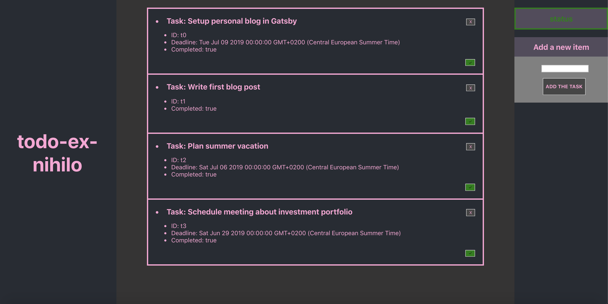
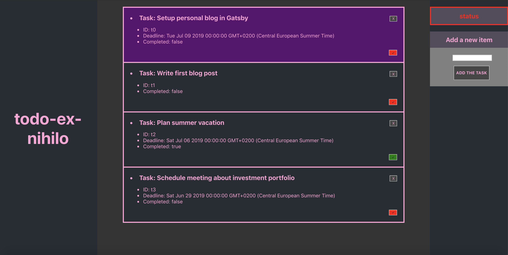

# todo-ex-nihilo

Outline for a todo app in Typescript and React.

## To run locally:

Run `yarn`, then `yarn start` and simply navigate to [http://localhost:3000](http://localhost:3000/)

## Screenshots

## License

MIT
